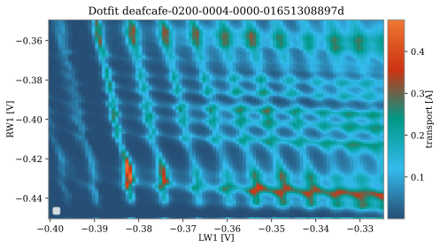

.. _ classification:

Classification
==============

nanotune replaces the experimenter's decision making by binary classifiers
predicting either quality of a measurement or charge stage found in charge
diagrams. Due to a large variety of regimes and noise types not reproduced by
synthetic models,
it uses hand-labelled experimental measurements to train them. Given the
difficulty of collecting and labelling these datasets, binary classifiers,
which are less data hungry than neural networks, are used.

Classifier
----------

nanotune's `Classifier` class emulates binary classifiers implemented in
scikit-learn. One can choose among the following classifiers at initialization:

- SVC
- LogisticRegression
- MLPClassifier
- GaussianProcessClassifier
- DecisionTreeClassifier
- RandomForestClassifier
- AdaBoostClassifier
- GaussianNB
- QuadraticDiscriminantAnalysis
- KNeighborsClassifier.

The `Classifier` wraps some of the methods found in sklearn, such as
splitting data into train and test sets, and implements these tailored to data
measured with QCoDeS.
Its methods allow to prepare data loaded from QCoDeS datasets, i.e.
by loading it into a nanotune dataset, traces are scaled using previously measured
normalization constants. Training data is selected at random from the available
dataset so that both labels appear equally often. Principle components can also
be calculated and used for classification.

Synthetic vs experimental data
------------------------------

The issue with using synthetic data to train machine learning classifiers to
predict the charge state is that models often fail to capture the large variety
of regimes. The model implemented in nanotune for example, is able to produce
diagrams as those below.

|capasd| |capadd|

These diagram show ideal regime without noise.
Beside the capacitance model, datasets based on other models have been
used as well.
One of them is the
`QFlow-lite  <https://github.com/jpzwolak/QFlow-lite>`_ dataset. A
difference between nanotune's synthetic data is that QFlow-lite data
provides double dot diagrams showing triple points instead of the honey comb
structure. Additionally, it is also able to reproduce a transition between
single and double dot regime.
To potentially improve classification accuracy, noise models can be added to
synthetic data, however it has been
shown that it does not increase classification accuracy (Darulova et al. 2021).

In contrast, experimental data can look similar, yet different. A diagram can
contain more than one valid regime and various noise types. A double dot does
not always look like a honeycomb structure and does not always show only
triple points. Below a few examples of both single and double dots.

|sd1| |sd2|

Experimental single dots.

In general, this charge state can be reproduced by
models fairly well. But these examples show that experimental data will
always have some noise and maybe regions with poor regimes.

.. |dd2| image:: ./figs/dotfit_deafcafe-0200-0004-0000-01659f3e3104.svg
   :width: 45 %

.. |dd3| image:: ./figs/dotfit_deafcafe-0200-0004-0000-01659d4319a6.svg
   :width: 45 %

|dd1| |dd4|

Experimental double dot diagrams showing that a double dot does not always look
the same, and especially, does not necessarily look similar to modelled data.
Note that as these diagrams were taken by measuring direct current through the
device, not all charge transitions are visible. Some of them, mainly in the
lower left corner, are below the noise floor.

|dd2| |dd3|
Experimental double dot diagrams with multiple regimes within the
same image.

This variation is the reason why nanotune segments charge diagrams into
sub-regions for classification. Each sub-region is classified separately.

Labelling
---------

When using labelled experimental data, the labelling process brings another
challenge with it. Not only is the process time consuming, but the regime
might not be clear-cut. In fact, each labeller might label diagrams differently,
inducing a bias which may confuse the classifier.
A strategy could be sample
a few examples, based on which a set of rules are fixed. A few relevant questions
to answer before starting to label are the following. Most of the also apply
other data such as pinch off curves.

- When is a regime good?
- Does readout related noise can make a regime bad?
- Which regime does a single to double dot transition belong to? E.g. when single
  dot lines start to wiggly and the system is in a transition to a double dot.
- Do we want to classify quality at all? `QFlow-lite  <https://github.com/jpzwolak/QFlow-lite>`_
  foe example uses different labels than nanotune. Here, the classifier decides
  between single, double and no dot.
- How are multi-regime diagrams labelled?

To help answer these questions, one could think about what the subsequent tuning
requires. Does it have to locate triple points? Or does it need to find the single
electron regime? Can we deal with noise later on?
A different end goal may require different labels.

Below are three examples of data which may pose some labelling difficulties and
could be used to decide on a set of "labelling rules".

|noise1| |noise2| |noise3|

Labelling tool
--------------

nanotune has a simple tool trying to alleviate the pain of labelling, called
the `LabellingTool`. From experience, having a window displaying each
measurements and buttons to click for each label, makes the whole procedure
faster and more reliable. The selected labels are saved to metadata of the
QCoDeS dataset. Below a screenshot of this window, an example notebook of how
to launch it can be found in :ref:`examples`.

.. _fig_labellingtool:

    Screenshot of nanotune's labelling tool.
