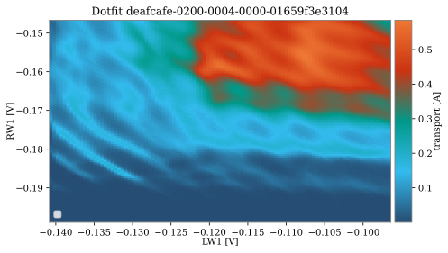

.. _ classification:

Classification
==============

nanotune replaces the experimenter's decision making by binary classifiers
predicting either quality of a measurement or charge stage of charge diagrams.
Due to a large variability not captured in synthetic models of this data,
it uses hand-labelled experimental measurements to train them. Given the
difficulty of collecting and labelling these datasets, classifiers
which are less data hungry than neural networks are used.

Classifier
----------

nanotune's classifier class emulates binary classifiers implemented in
scikit-learn. It support several different types, which can be specified during
initialization. Its methods allow to prepare data loaded from QCoDeS datasets, i.e.
by loading it into a nanotune dataset, traces are scaled using previously measured
normalization constants. Training data is selected at random from the available
dataset so that both labels appear equally often. Principle components can also
be calculated and used, however studies showed (Darulova et al. 2020) that
they don't increase prediction accuracy.

Experimental data
-----------------
* in preparation *

As mentioned above, hand-labelled experimental data is used. Examples are shown
below.

.. _single_dot_example:
.. figure:: ./figs/dotfit_deafcafe-0200-0004-0000-0165b06bd0af.svg
    :alt: Double dot fit.
    :align: center
    :width: 60.0%

    Example of a single dot fit.

.. _double_dot_example:
.. figure:: ./figs/dotfit_deafcafe-0200-0004-0000-0165a07ff8df.svg
    :alt: Double dot fit.
    :align: center
    :width: 60.0%

    Example of a double dot fit.

.. _double_dot_example2:

    Example of a double dot fit.

.. _double_dot_example3:
.. figure:: ./figs/dotfit_deafcafe-0200-0004-0000-01659d4319a6.svg
    :alt: Double dot fit.
    :align: center
    :width: 60.0%

    Example of a double dot fit.

.. _double_dot_example4:

    Example of a double dot fit.

Synthetic data
--------------

- difficulty to reproduce all regimes encountered during tuning
- no good noise models so far to imitate noise found in real data

Comment on labelling
--------------------

- labelling tool or similar to ease the pain
- bias in labelling, best to decide on criteria beforehand and let several people label
- qflow labels are different
- make difference between good regime but poor measurement due to noise in readout?
- determine which data noise reduction can be used to improve accuracy.
- need to segment data as different areas of the same diagram can show different regimes.
