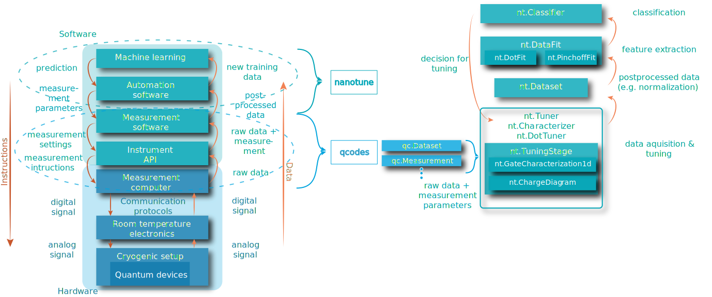

.. _data:

Data
====

Typical manual-tuning-inspired measurements are one- and two-dimensional traces
on a grid. While this is fairly limiting when dealing with multi-dimensional
spaces, it is currently the only human-analyzable way of taking data. As
nanotune's
tuning sequence is based on existing manual procedures, the measurements it
supports are 1D and 2D traces.

All measurements are done using QCoDeS and are thus saved to a database via a
QCoDeS dataset. However, nanotune has its own dataset
abstraction with a few extra functionalities convenient for tuning.

Dataset
-------

The dataset class emulates a QCoDeS dataset in order to standardize a few
naming conventions and adding post-processing steps. Using QCoDeS's
`to_xarray_dataset`, raw data is loaded into an xarray called `raw_data`.
Using the normalization constants saved to metadata of the QCoDeS dataset,
the raw data is normalized and retained in the `data` attribute, also an
xarray dataset.
The variables of this xarray are renamed to match the
standardized readout methods 'transport', 'sensing' and 'rf'. The reason being that
tuning and classification procedures need to know which trace belongs to which
readout methods. The information which readout instruments corresponds to which
readout method is saved to metadata during measurements.
Similarly, xarray datasets with a filtered signal and the power spectrum are
computed as well.

In general, all data measured with QCoDeS can be loaded into a nanotune
dataset. However, data not measured using nanotune will miss some metadata and
thus its normalization will be incorrect.
The required metadata is saved into QCoDeS' snapshot under the `nt.meta_tag` key,
which is defined in `nanotune.configuration.config.json`.

The following code is an example of how to load data into a nanotune dataset.

.. code-block:: python

    import os
    import nanotune as nt

    nt_root = os.path.dirname(os.path.dirname(os.path.abspath(nt.__file__)))
    db_pinchoff = os.path.join('data', 'tuning', 'device_characterization.db')

    ds = nt.Dataset(1203, db_pinchoff, db_folder=nt_root)

For more details see also `the dataset example notebook <../examples/dataset_example.ipynb>`__,

Databases
---------

As shown above and as opposed to QCoDes, nanotune does not rely on data run IDs
only. It also needs the database name and optionally the folder where the
database is located to find data.
The reason is that the volume of data recorded during automated tuning grows
significantly faster than during manual tuning. Not only becomes copying
databases larger than 10Gb cumbersome, but sometimes one wishes to
save data to several databases. One example are parallel
measurements, for which one database per sample could be used to avoid locked
.db files.

To facilitate switching databases as well as other tuning/classification
related functionalities, nanotune has a few helper functions.
The most used one simply sets a different database as the default accessed by
QCoDeS and nanotune:

.. code-block:: python

    import nanotune as nt
    nt.set_database("examples.db", db_folder="./")

Further, there are also functions searching for data with a specific machine
learning label, e.g. good pinchoffs. As these labels occupy a separate column in
the database, these functions utilize efficient SQLite queries.
The columns are initialized whenever a database is created using
'nt.new_database'.

Data flow
---------

The diagram shown in :numref:`fig_data_flow` illustrates the data and
instruction flow of quantum measurements.
The dotted ellipses indicates which stages are covered by QCoDeS or nanotune.
QCoDeS provides an interface to room-temperature instruments (i.e. drivers)
and tools to take and save measurements, while nanotune extends this functionality
by automating common procedures encountered during quantum dot initialization.

.. _fig_data_flow:

    Data flow during tuning with nanotune.

As stated above, all data is taken via QCoDeS, specifically by making use of its
measurement context manager. The data is taken during the device
characterization and dot-tuning sequence, which is implemented by the
:ref:`device_tuner` classes `Tuner`, `Characterizer` and `DotTuner`.
Specifically, the tuner classes call
:ref:`tuningstages` subclasses, i.e. `GateCharacterization1D` and
`ChargeDiagram`, which are responsible for measurements and correct metadata
saving.

Once measured, the data is loaded into nanotune's dataset, where the raw data is
post-processed, e.g. normalized. If required, Fourier frequencies or
filtered data is computed as well. The `DataFit` classes then extract features
such as the slope and amplitude of a pinchoff curve.
Based on these features as well as min and max values of the measured signal,
the device's transport regime, i.e. open, intermediate or
closed, can be determined. Either the extracted feature
vector or entire measurement is passed to the classifier for quality or
charge state prediction. Based on the outcome, a decision about
subsequent tuning is made.
