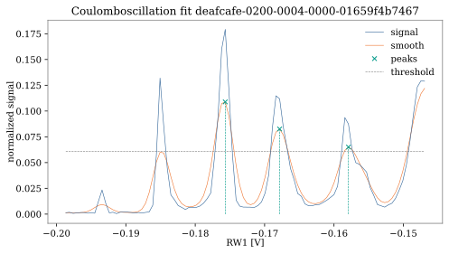

.. _coulomboscillationfit:

Coulomb oscillation fit
-----------------------

The `CoulombOscillationFit` class detects peaks within a 1D trace. To this end,
the `find_peaks` routine implemented in `scipy.signal` is used. It also
determines the voltage difference between consecutive peaks, which can then be
used to determine other quantities such as capacitances or lever arms.

An example of a Coulomb oscillation fit is shown below. Note that this routine
is currently not very robust against noise, i.e. some noise is mistaken for peaks.
It has not been used in the demonstration of the initial
nanotune tuning procedure (autonomous tuning paper).

.. _coulomb_fit:

    Example of a Coulomb oscillation fit.
