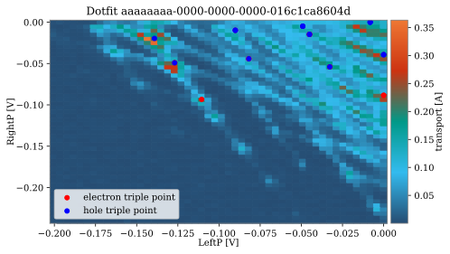

.. _dotfit:

Dot fit
=======

The `DotFit` class aims to locate triple points in double dot charge diagrams. It does
not cover single dots.
In an ideal case, the final charge diagram of a coarse tuning algorithm shows
triple points easily locatable so that a fine-tuning algorithm can continue and
improve the regime.
The current implementation uses a peak finding algorithm to locate voltage
combinations showing a higher signal and tries to assign the type of triple
point, electron or hole, to each peak.
To detect the peaks, a binary structure of the diagram is computed and
used as a mask to remove noise. The peaks are then etermined trough binary erosion.
All three methods used, `binary_erosion`, `generate_binary_structure` and
`maximum_filter` are implemented in `scipy.ndimage.filter` and
`scipy.ndimage.morphology`.

Unfortunately, the current implementation only works with excellent/synthetic
data, which is the reason why it has not been used for the autonomous tuning
paper. An example of the fit is shown below.

.. _dot_fit:

    Example of a double dot fit.

Dot labels
    Charge diagrams in nanotune come in four flavors: good single, poor single,
    good double and poor double dot. The idea behind this choice is to be able to
    predict not just the dot regime, but also its quality. Similar to pinchoff curves,
    labelling data imposes a bias to how new data is going to be classified. The
    range of regimes is far bigger here though.

    In code, the four regimes are labelled by four integers, which defined in
    `nanotune.configuration.conf.json` under the `dot_mapping` key:

    - 0: good single
    - 1: poor single
    - 2: good double
    - 3: poor double.

    When classifying the quality of a specific regime, regular labels of True/1, 0/False
    are used.
