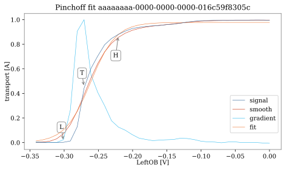
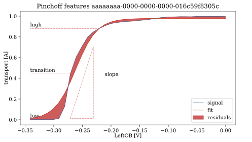

PinchoffFit
-----------

The PinchoffFit class implements a hyperbolic tangent fit to extract features
such as amplitude, slope, residuals etc. It also determined the active range of
the gate swept, indicated by L and H in the plot on the left, and the
transition voltage, indicated by T. Both, the active range and the transition
voltage, are calculated based in the first derivative of either the fit or
normalized data.

Examples of poor and good pinch-off curves. The label poor is attached to
measurements where the current doesn't reach zero or if the current drop is
not clear. A flatter drop is still considered good as what we care about most
is a gate's ability to deplete the electron gas nearby.

.. _pinchoff_fit:

    Example of a pinchoff fit.

.. _pinchoff_features:

    Pinchoff features explained.

Pinch-off curves are labelled good (1, True) or poor (0, False).

