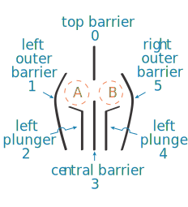
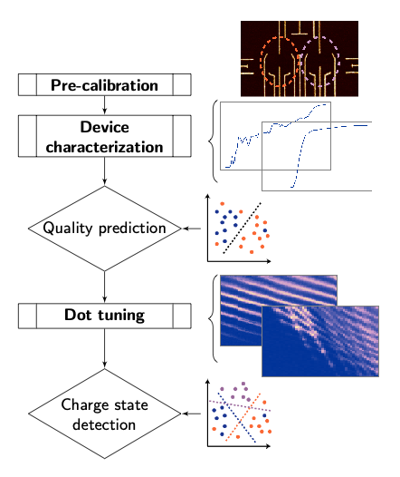

Overview
========

Nanotune was implemented as part of a PhD project with the goal to initialize
gate-defined quantum dots without human interaction and no pre-measured input.
It automates
typical manual measurements and replaces the experimenter's quality and charge
state assessment by supervised machine learning. In a very simplified way,
the implemented dot-tuning sequence can be thought of as a
for-loop with a couple of if-statements which hard code the tuning logic.
Being based on QCoDeS, nanotune extends the data acquisition software by
adding  automated tuning procedures which use machine learning models
implemented in scikit-learn.
For successful autonomous tuning, only the following, minimal input is required:

- bonding scheme/routing, i.e. which DAC channel corresponds to which gate,
- device layout, i.e. number and arrangement of gates,
- safety voltage ranges, i.e. which voltages can be applied without damaging the device,
- setup specific noise floor - to ensure noise is not mistaken for an open
  regime in pre-calibration steps.

The dot-tuning sequence was demonstrated on double quantum dots formed in a
GaAs two-dimensional electron gas, however no assumptions about the material
were made. The gate layout of the devices used consist of
six gates: four so-called barriers and two plungers, shown in figure
:numref:`fig_dev_scheme`.

.. _fig_dev_scheme:

    Gate layout of the device used to demonstrate autonomous tuning. `A` and `B`
    represent dots.

Barrier gates typically create potential wells between them, defining tunnel resistances
between dots and reservoirs. Plungers are used to adjust the
electrochemical potential of a dot, changing the number of electrons if desired.
Except for the top barrier, the tuning is identical to the tuning of quantum
dots formed in 1D systems such as nanowires. All measurements were taken in
DC transport, i.e. measuring current through the device. This readout method
can be replaced by sensing technique easily.

Tuning workflow
---------------

The dot-initialization workflow consists of two pre-calibration, one
characterization and one tuning step, as outlined in the flowchart pictured in
:numref:`fig_workflow`.

.. _fig_workflow:

    Device tuning workflow.

A gate leakage test and initial quality assessment ensure that devices
are 'alive', meaning that voltages can be set and the current through the
device is above the specified noise floor. The characterization step
identifies devices that are fully functional, which is defined as all gates
being able to deplete the electron gas nearby, also referred to as pinching off.
Similar to a manual approach, each gate is characterized individually by
stepping over its safety range while measuring the current through the device.
The desired feature, a sharp current dip reaching zero, is confirmed by a
binary classifier trained with experimental data. Only if traces of all gates
show a good pinchoff, a device is tuned.

The subsequent dot-tuning sequence is able to tune into either the single and
double dot regime, with the main difference being the voltage value set to the
central barrier. To form a double dot, a more negative value (when tuning in
depletion mode) is required than for the single dot regime.
Specifically, the dot-tuning process consists of a sequence of one- and
two-dimensional measurements, referred to as gate characterizations and
charge diagrams. Each measurement is assessed by a binary
classifier to determine quality and, in the case of a charge diagram, the
charge state (i.e. single vs double dot).
Gate characterizations are used to determine each gate's 'active' voltage
range. An active voltage range, also called `current_valid_range`, is the
range within which we expect the desired charge state to occur. A sequence of
faster, one-dimensional measurements is an efficient way to narrow down the
large parameter space before proceeding with more time consuming
two-dimensional measurements. Due to capacitive coupling, active ranges need
to be updated each time the voltage of a nearby gate is changed.
Once all gates are characterized and barriers set to a value within their
active range, the plungers are swept to measure a charge diagram. Note that
the top barrier is set first and that the remaining tuning sequence is the
same as for 1D systems.
Depending on the classification outcome of the charge diagram as well as
additional checks assessing whether the device is in an open, closed or
intermediate transport regime, gate voltages are adjusted. The precise
sequence of measurements is discussed in :ref:`tuning`.

Implementation
--------------

The main modules implementing the dot-tuning are the `Device`, `Tuner`,
`TuningStage`, `DataFit` and `Classifier` classes. These classes work together as follows:
A subclass of `TuningStage`, currently either `GateCharacterization1D` or
`ChargeDiagram`, is responsible for taking data and verifying whether the
result is satisfying. To do the latter, a fit is performed via one of the
`DataFit` subclasses and either the extracted feature vector or the entire
measurement is classified. `GateCharacterization1D` uses `PinchoffFit`, while
`ChargeDiagram` relies on `DotFit` for fitting.
The `Tuner` classes implement the tuning sequence itself by combining
instances of `TuningStages` with a hard-coded decision logic forming either one
or two dots. There are two `Tuner` subclasses, a `Characterizer` performing
the a device characterization and a `DotTuner`.
A `Tuner` class acts on an instance of a `Device` class, which represents the
physical device including a list of gates, ohmics, gate layout and readout
methods.

Acknowledgments
---------------

A special thanks goes to Matthias Troyer, Maja Cassidy, David Reilly and
Charles Marcus for initiating, supervising and pushing over the finish line
the PhD project, which resulted in the original version of nanotune. Chris
Granade, Nathan Wiebe, John Hornibrook - your inputs were invaluable in
implementing several modules. Alice Mahoney, Sebastian Pauka, Rachpon Kalra -
thank you for setting up fridges and prepping devices, making it possible for
automated tuning to be developed, tested and demonstrated. William H.P. Nielsen
and Jens Nielsen - both your patience and help with qcodes was essential.
