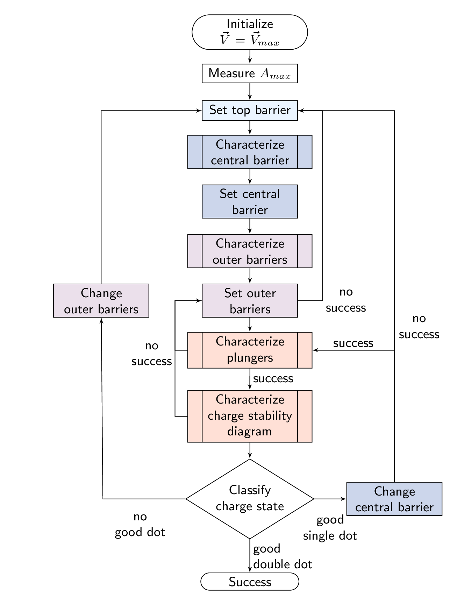

.. _device_tuner:

Device tuner
============

Tuner
-----

The base class implements the most common tuning methods such as updating a
device's normalization constants, measuring a pinchoff or taking a charge diagram.
These methods use the corresponding :ref:`tuningstages` to take and
analyse data. In general, a tuner acts on an instance of
:ref:`device` to perform the tuning. It has methods to combine default
measurement settings defined in the tuner's data and setpoint settings with
device-related ones.

Measurement settings
    Measurement related settings are grouped in two dataclasses, `DataSettings`
    and `SetpointSettings`. A tuner class keeps an instance of each with
    general settings used for tuning of all devices. Examples of setpoint
    setting used
    for all measurements are `setpoint_method`, optionally `voltage_precision` and
    high resolution precisions. As for data settings, data base location or
    size of charge diagram segments used for classification also stay unchanged
    in most cases.

Beside the methods listed above, the base class also has a method to determine
the initial ranges of a helper gate, such as
a top barrier of a 2D layout or bottom gate underneath the entire 1D system.

Tuning results are saved whenever a `TuningResult` is returned by a tuning stage,
i.e. when measuring a pinchoff or charge diagram. They are saved to the tuner's
`tuning_history` using the device name as key. Saving results in these low
lying methods used in every other tuning procedure ensures that all of them
are retained.

Characterizer
-------------

The `Characterizer` sub-class implements the device characterization step by
applying the base class' gate characterization step to all gates. Optionally,
gates can be left out, e.g. in the case of a helper gate which has been set
beforehand.

Dot tuner
---------

The `DotTuner` contains methods required to implement the tuning procedure
shown in :numref:`tuning_algorithm`.
If desired, the entire sequence can by run using the `tune` method, however
all methods should also be seen as building blocks for other sequences.

.. _tuning_algorithm:

   Dot tuning algorithm implemented by the `DotTuner` class.

The steps outlined in the diagram have a corresponding method within the class.

+--------------------------------------+-------------------------------------------------------------+
|step                                  |                 method                                      |
+======================================+=============================================================+
|Set top barrier                       |           `set_helper_gate`                                 |
+--------------------------------------+-------------------------------------------------------------+
|Characterize central barrier          |                                                             |
|Set central barrier                   |          `set_central_barrier`                              |
+--------------------------------------+-------------------------------------------------------------+
|Characterize outer barriers           |                                                             |
|Set outer barriers                    |          `set_outer_barriers`                               |
+--------------------------------------+-------------------------------------------------------------+
|Characterize plungers                 | `characterize_plunger`, used in `set_valid_plunger_ranges`  |
+--------------------------------------+-------------------------------------------------------------+
|Characterize charge stability diagram |          `get_charge_diagram`                               |
+--------------------------------------+-------------------------------------------------------------+
|Classify charge state                 |         in `get_charge_diagram`                             |
+--------------------------------------+-------------------------------------------------------------+
|Change central barrier                |      `update_gate_configuration`                            |
+--------------------------------------+-------------------------------------------------------------+

Note that `get_charge_diagram` adjusts plunger ranges if the resulting diagram
shows a signal too low or too high for a dot regime. If the signal is too high,
the plunger ranges are decreased and increased if too low. If the plunger ranges
hit their safety voltage ranges during this update, outer barriers are
adjusted. This is the small inner loop labelled `no success` on the left.
Similarly, if no plunger ranges within the respective safety limits are found to
begin with, the outer barriers are changed.

When the desired dot regime is not found, `update_gate_configuration`
which implements the loop going left and right from "Classify state", is called.
It executes `adjust_all_barriers_loop`, which in turn calls `adjust_all_barriers`,
but with different inputs depending on the classification outcome.
`adjust_all_barriers_loop` sets adjusts voltage of one gate, specified as input,
before launching `adjust_all_barriers`.
If required, i.e. adjusting outer or central barriers was not successful
because they reached their safety limit, the helper gate is changed too.

Specifically, these two outer loops in :numref:`tuning_algorithm`
do teh following:

Large left loop - no good dot found:
 - Uses termination reasons to update outer barriers first. The decisive
   information is whether the device was too pinched off or open.
 - Update top barrier/helper gate in `adjust_all_barriers`, called in `adjust_all_barriers_loop`

Right loop - no success changing central barrier:
    - Change central barrier with `initial_voltage_update` in `adjust_all_barriers_loop`.
    - If central barrier is set successfully, the loop in `adjust_all_barriers_loop` is not executed and thus tuning resumes with plunger range characterization.
    - If after setting the central barrier other changes are needed, the loop in `adjust_all_barriers_loop` will set the top barrier, then central and also outer barriers.

The class also has methods to take high resolution charge diagram, with voltage
precisions specified in `setpoint_settings.high_res_precisions`. There are two
types of high res diagram: the entire one and only diagram segments which have
been classified to be the target regime, e.g. good double. This serves to
confirm the tuning result and get data for publications or presentations.

Demonstration

    The
    `autonomous tuning paper <https://journals.aps.org/prapplied/abstract/10.1103/PhysRevApplied.13.054005>`_
    showed that this tuning procedure is able to tune several devices without
    manual input. For good devices, only one pass through the algorithm is
    required, meaning only a few 1D and a one 2D measurement is taken.
    The loops adjusting barriers is not executed.
