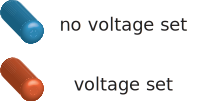

.. _tuning:

Tuning
======

The :ref:`device_tuner` module implements the tuning outlined in the workflow diagram
:numref:`fig_workflow`. Device characterization and dot tuning are covered by
two separate sub-classes of the `Tuner` base: `Characterizer` and `DotTuner`.
A tuner class acts on an instance of :ref:`device` to perform the tuning.
Each of them uses two different types of :ref:`tuningstages`, the
`GateCharacterization1D` and `ChargeDiagram`, to take and analyse data. Tuning
results are saved in an instance of a `TuningHistory`, relying on `TuningResult`
and `MeasurementHistory`, all of which are described in :ref:`results_saving`.

.. |nw13| image:: ./figs/nw_dots-13.svg
   :width: 45 %

.. |array| image:: ./figs/nw_dots-20.svg
   :width: 8 %

.. |nw06| image:: ./figs/nw_dots-06.svg
   :width: 40 %

|nw13| |array| |nw06|   |labels|

The general goal of dot tuning illustrated on a nanowire: by setting voltages to
all electrostatic gates, well-defined quantum dots can be formed.

.. toctree::
   :maxdepth: 2

   manual_tuning
   device_tuner
   tuningstages
   results_saving
