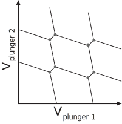
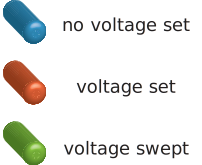
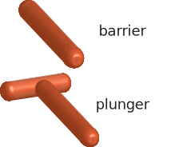
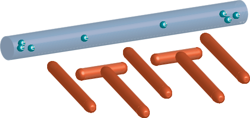
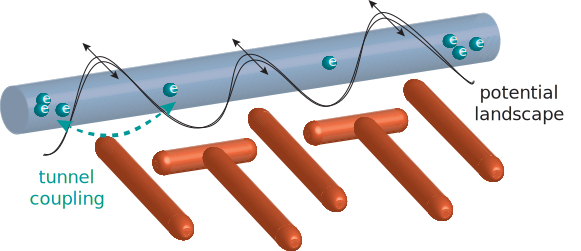
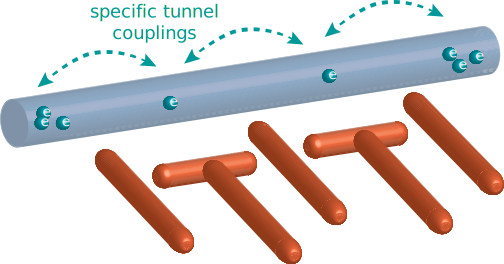
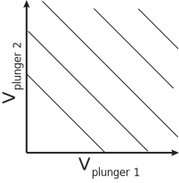

.. _manual_tuning:

Manual tuning
=============

*In preparation*

.. |empty| image:: ./figs/nw_dots-01.svg
   :width: 45 %

.. |barriers| image:: ./figs/nw_dots-02.svg
   :width: 45 %

.. |chargediagram| image:: ./figs/nw_dots-15.svg
   :width: 45 %

.. |sweepsingle| image:: ./figs/nw_dots-14.svg
   :width: 45 %

Set barriers

    |empty| |array| |barriers|

|labelsgates|

Take charge diagram

Single dot:

    |labels| |sweepsingle| |singlechargediagram|

Double dot:

    |chargediagram| |chargediagrammeasurement|

Fine tuning:

Single electron regime

    |singleelectron|

Tunnel coupling fine tuning
    |tunnelcoupling| |tunnelcoupling2|