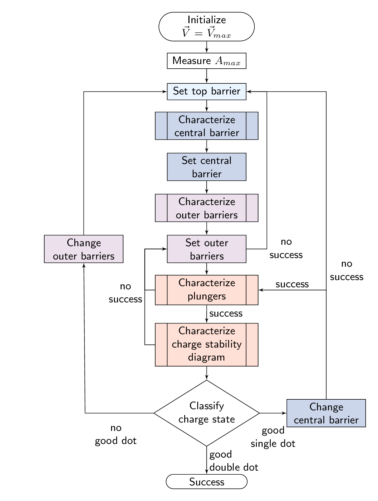

======
Tuning
======

.. toctree::
   :maxdepth: 2

.. figure:: ../overview/workflow_small_1.png
   :alt: Tuning workflow overview.
   :align: center
   :width: 45 %

   Overview of tuning workflow.

Tuner
-----

Characterizer
-------------

DotTuner
--------
entire tuning of 2D device: dottuner.tune

   Dot tuning algorithm implemented by the DotTuner class.

"Set top barrier": `set_helper_gate`

"Characterize central barrier" and "Set central barrier": `set_central_barrier`

"Characterize outer barriers" and "Set outer barriers": `set_outer_barriers`

"Characterize plungers": `characterize_plunger`, used in `set_valid_plunger_ranges`

"Characterize charge stability diagram" and "Classify charge state": `get_charge_diagram`, classification result in returned TuningResult instance.
`get_charge_diagram` changes plunger ranges if needed, executing the small inner lop on the left.

"Change central barrier": `update_gate_configuration`

The loop going left and right from "Classify state" are in `update_gate_configuration` (calls `adjust_all_barriers_loop`, which in turn calls `adjust_all_barriers`, which sets the top barrier, central barrier)

left loop:
 - uses termination reasons to update outer barriers first (if device was too pinched off or open)
 - update top barrier/helper gate in `adjust_all_barriers`, called in `adjust_all_barriers_loop`
 - update top barrier

right loop:
- change central barrier with `initial_voltage_update` in `adjust_all_barriers_loop`.
- if central barrier is set successfully, the loop in `adjust_all_barriers_loop` is not executed and thus tuning resumes with plunger range characterization.
- if after setting the central barrier other changes are needed, the loop in `adjust_all_barriers_loop` will set the top barrier, then central and also outer barriers.

In both loops: of outer barrier can not be set, the top barrier is changed again.

`set_central_and_outer_barriers`: loop set central barrier - set outer barriers - update helper gate - set outer barriers

`adjust_all_barriers_loop`: update voltages based on input directives and run `adjust_all_barriers` in a loop.

`choose_new_gate_voltage`:
