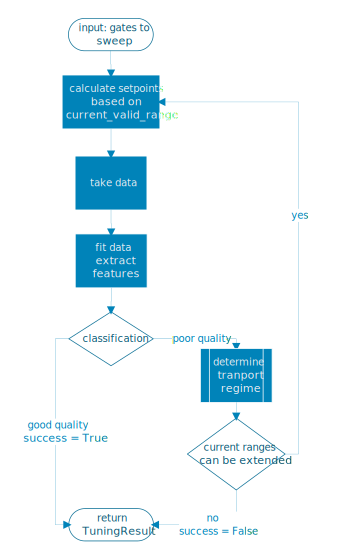

.. _tuningstages:

Tuningstages
============

The `TuningStage` abstraction represents a typical step of both manual and
automated tuning, its workflow is illustrated in :ref:`tuningstage_workflow`.
This base class is meant to be sub-classed, where each sub-classes implements
the methods called during the workflow.

.. _tuningstage_workflow:

   The tuningstage workflow implemented by the base class and used by all
   sub-classes.

A `TuningStage` takes as input a list of parameters which are to be swept,
as well as the parameters' safety ranges and (trained) machine learning models
to use for classification. Setpoints are
calculated based on the ranges to sweep, also an input parameters and which
have been determined during previous tuning. The current default method returns
linearly spaced setpoints but is meant to be changed in the future.

Once the data is taken, it is fitted via a DataFit sub-class. Either the
extracted feature vector or the entire measurement (normalized, filtered
or Fourier frequencies) are passed to the classifier for a quality or regime
assessment.
If the desired quality/regime is found, a `TuningResult` instance is returned.
If not, the signal strength is checked to determine whether sweep
ranges need to be adjusted. If the detected current is too low/high,
voltage ranges are adjusted towards more positive/negative values.
If the new ranges do not exceed the gates' safety ranges, the measurement
loop resumes by calculating new setpoints. If safety ranges have been reached,
the `TuningStage` returns an instance of a TuningStage indicating a
unsuccessful run.

Currently implemented subclasses are `GateCharacterization1D` and
`ChargeDiagram`. All methods used in these classes have been refactored so
that they can be used without the `TuningStage` abstraction as well.
They are in the `*tasks.py` files located close to the classes' implementations.

Gate characterization
---------------------

`GateCharacterization1D` implements pinchoff curves. See
`the notebook <../examples/Example_gate_characterization.ipynb>`__
for an example.

Charge diagram
--------------
`ChargeDiagram` takes a 2D scan, most often plungers. See
`the notebook <../examples/Example_charge_diagram_stage.ipynb>`__ for an example.
